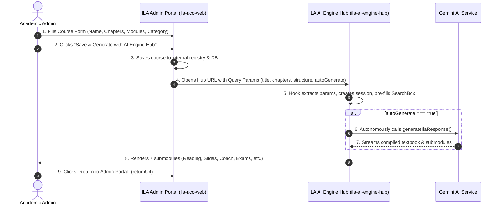

# ILA AI Engine Hub • URL Operations & Inbound Course Ingestion Specification

**Document Version**: 1.0.0  
**Target Systems**: `ila-ai-engine-hub` (`http://localhost:3000/` / `d:\ILA\ila-ai-engine-hub_09.10.26`) and `ila-acc-web` (`d:\ILA\ila-acc-web-main-11.09.26`).

---

## 1. Executive Overview

This specification defines the seamless, bi-directional interconnection between the **ILA Admin Management Portal** (`ila-acc-web`) and the standalone **ILA AI Engine Hub** (`ila-ai-engine-hub`).

### Workflow Architecture
1. **Curriculum Planning in Admin Portal**:
   - The academic administrator configures Course Title, Category, Sub-Category, Chapter Count, Duration, Instructor, Fee, Delivery Methods, and Course Structure inside the `CourseCreator` component within `ila-acc-web`.
2. **Local Persistence**:
   - The course record is saved locally in IndexedDB / LocalStorage state with an auto-generated Composite Course ID.
3. **Triggering AI Engine Hub**:
   - Clicking **"Save & Generate with AI Engine Hub"** opens the AI Engine Hub in a new tab, passing structured course parameters via standard URL query parameters (or URL hash operations).
4. **Autonomous Ingestion & Generation**:
   - The AI Engine Hub reads the incoming URL parameters, creates an authoring session, pre-fills the prompt/SearchBox, maps the pedagogical persona ("Studied By"), and automatically triggers curriculum generation if `autoGenerate=true`.
5. **Round-Trip Navigation**:
   - The AI Engine Hub displays a "⬅ Return to Admin Portal" button linking directly back to `returnUrl`.



---

## 2. Inbound URL Parameters Schema

The AI Engine Hub must listen for and parse the following query parameters upon initial load:

| Parameter Key | Type | Example Value | Description |
|---|---|---|---|
| `courseName` | `string` (URI-encoded) | `German A1 Comprehensive` | Primary title of the course. |
| `category` | `string` (URI-encoded) | `German Language` | Academic parent category. |
| `subCategory` | `string` (URI-encoded) | `German Language (A1–C2)` | Track or specialization. |
| `topTitle` | `string` (URI-encoded) | `Master Certification` | Course badge or level tag. |
| `chapters` | `number` / `string` | `12` | Total requested chapters. |
| `duration` | `string` (URI-encoded) | `8 Weeks` | Program duration. |
| `staff` | `string` (URI-encoded) | `Senior Academic Lead` | Assigned instructor or academic lead. |
| `fee` | `string` (URI-encoded) | `299` | Course tuition/fee. |
| `methods` | `string` (URI-encoded) | `AI + Adaptive Tutoring` | Delivery methods. |
| `pathName` | `string` (URI-encoded) | `Intensive Language Track` | Assigned education path. |
| `batchName` | `string` (URI-encoded) | `Morning Cohort A` | Assigned batch slot. |
| `courseStructure` | `string` (URI-encoded) | `Module 1: Syntax...` | Chapter outline, syllabus, or prompt guidance. |
| `compositeId` | `string` (URI-encoded) | `CAT-GER-PTH-A1-001` | Composite catalog identifier. |
| `autoGenerate` | `boolean` (`'true'` \| `'false'`) | `true` | If `true`, immediately initiates AI generation. |
| `returnUrl` | `string` (URI-encoded) | `http://localhost:5173/admin` | Calling admin app URL for return navigation. |

---

## 3. Implementation in `ila-ai-engine-hub`

To accept and process these operations, implement the following components in `ila-ai-engine-hub_09.10.26`:

### 3.1 Step 1: Create the URL Parser Hook (`src/hooks/useCourseUrlParams.ts`)

Create a new hook file in `src/hooks/useCourseUrlParams.ts`:

```typescript
import { useEffect, useState, useRef } from 'react';

export interface InboundCourseParams {
  courseName: string;
  category?: string;
  subCategory?: string;
  topTitle?: string;
  chapters?: string;
  duration?: string;
  staff?: string;
  fee?: string;
  methods?: string;
  pathName?: string;
  batchName?: string;
  courseStructure?: string;
  compositeId?: string;
  autoGenerate: boolean;
  returnUrl?: string;
}

export function useCourseUrlParams() {
  const [inboundParams, setInboundParams] = useState<InboundCourseParams | null>(null);
  const processedRef = useRef(false);

  useEffect(() => {
    if (processedRef.current) return;

    try {
      const searchParams = new URLSearchParams(window.location.search);
      const courseName = searchParams.get('courseName') || searchParams.get('title');

      if (!courseName) return;

      const params: InboundCourseParams = {
        courseName: decodeURIComponent(courseName),
        category: searchParams.get('category') ? decodeURIComponent(searchParams.get('category')!) : undefined,
        subCategory: searchParams.get('subCategory') ? decodeURIComponent(searchParams.get('subCategory')!) : undefined,
        topTitle: searchParams.get('topTitle') ? decodeURIComponent(searchParams.get('topTitle')!) : undefined,
        chapters: searchParams.get('chapters') || undefined,
        duration: searchParams.get('duration') ? decodeURIComponent(searchParams.get('duration')!) : undefined,
        staff: searchParams.get('staff') ? decodeURIComponent(searchParams.get('staff')!) : undefined,
        fee: searchParams.get('fee') || undefined,
        methods: searchParams.get('methods') ? decodeURIComponent(searchParams.get('methods')!) : undefined,
        pathName: searchParams.get('pathName') ? decodeURIComponent(searchParams.get('pathName')!) : undefined,
        batchName: searchParams.get('batchName') ? decodeURIComponent(searchParams.get('batchName')!) : undefined,
        courseStructure: searchParams.get('courseStructure') ? decodeURIComponent(searchParams.get('courseStructure')!) : undefined,
        compositeId: searchParams.get('compositeId') || undefined,
        autoGenerate: searchParams.get('autoGenerate') === 'true',
        returnUrl: searchParams.get('returnUrl') ? decodeURIComponent(searchParams.get('returnUrl')!) : undefined,
      };

      processedRef.current = true;
      setInboundParams(params);

      // Clean the URL query params without triggering a reload to keep browser history tidy
      const cleanUrl = window.location.pathname + window.location.hash;
      window.history.replaceState({}, document.title, cleanUrl);
    } catch (err) {
      console.error('Failed to parse inbound course URL parameters:', err);
    }
  }, []);

  return inboundParams;
}
```

---

### 3.2 Step 2: Integrate into `src/App.tsx`

In `src/App.tsx` of `ila-ai-engine-hub`:

1. **Import the hook**:
   ```typescript
   import { useCourseUrlParams } from './hooks/useCourseUrlParams';
   ```

2. **Consume the inbound parameters**:
   ```typescript
   const inboundCourse = useCourseUrlParams();

   useEffect(() => {
     if (!inboundCourse) return;

     // 1. Synthesize a comprehensive academic textbook prompt
     const synthesizedPrompt = `Create a complete academic course curriculum and textbook for "${inboundCourse.courseName}".
   Category: ${inboundCourse.category || 'General'} / Track: ${inboundCourse.subCategory || 'Standard'}
   Total Chapters: ${inboundCourse.chapters || '10'} Chapters
   Pacing & Duration: ${inboundCourse.duration || 'Standard Term'}
   Delivery Method: ${inboundCourse.methods || 'AI + Adaptive Tutoring'}
   ${inboundCourse.courseStructure ? `\nSyllabus & Module Guidance:\n${inboundCourse.courseStructure}` : ''}
   
   Structure each chapter with detailed pedagogical breakdowns, real-world examples, chapter summaries, diagnostic quiz questions, and slide presentation outlines.`;

     // 2. Set the SearchBox input or prefill the active session prompt
     setSearchQuery(synthesizedPrompt);

     // 3. Match learner persona if available
     if (inboundCourse.subCategory || inboundCourse.category) {
       // Optionally auto-select matching LEARNER_CATEGORIES item
     }

     // 4. If autoGenerate is true, trigger generation automatically
     if (inboundCourse.autoGenerate) {
       // Invoke the course creation pipeline:
       // handleCreateNewCourseSession(inboundCourse.courseName, synthesizedPrompt);
       // or call generateIlaResponse(synthesizedPrompt);
     }
   }, [inboundCourse]);
   ```

3. **Render Return Navigation Button in Primary Navbar**:
   ```tsx
   {inboundCourse?.returnUrl && (
     <a
       href={inboundCourse.returnUrl}
       className="px-3 py-1.5 bg-slate-800 hover:bg-slate-700 text-white text-xs font-bold rounded-xl border border-slate-600 flex items-center gap-1.5 transition-all shadow-xs"
       title="Return to ILA Admin Portal"
     >
       <span>⬅ Return to Admin Portal</span>
     </a>
   )}
   ```

---

## 4. Verification Checklist

To verify the integration end-to-end:

1. In `ila-acc-web-main-11.09.26`:
   - Navigate to **Education Hub** -> **Course Creator**.
   - Fill in a test course (e.g. `Advanced Medical German A2`, 10 Chapters, 6 Weeks).
   - Click **"Save & Generate with AI Engine Hub"**.
   - Confirm that:
     - The course is saved in the local course list without loss of state.
     - A new tab opens to `http://localhost:3000/?courseName=...`.
2. In `ila-ai-engine-hub_09.10.26`:
   - Verify the URL query parameters are extracted.
   - Verify the prompt text area is pre-populated with the synthesized course prompt.
   - Verify the "⬅ Return to Admin Portal" button appears and navigates back seamlessly.
