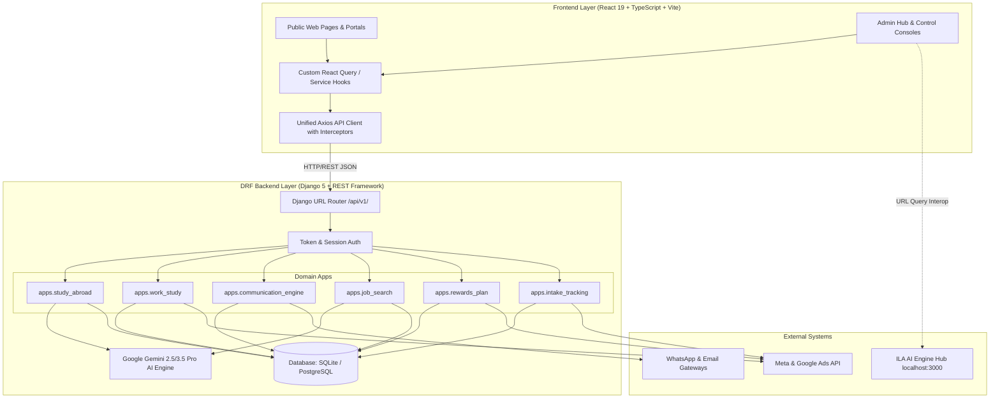

# 🌐 ILA Global — DRF Backend Integration Master Blueprint & Architecture Specification

**Document Version**: 2.0.0  
**Target Systems**: `ila-acc-web` Frontend (React 19 / TypeScript / Vite / Tailwind CSS 4) & `django_backend` (Django 5.x / Django REST Framework / Gemini AI Engine).  
**Workspace Root**: `d:\ILA\ila-acc-web-main-11.09.26`

---

## 📑 Table of Contents

1. [Executive Architectural Vision](#1-executive-architectural-vision)
2. [Global Architecture & Network Topology](#2-global-architecture--network-topology)
3. [Environment Configuration Specification](#3-environment-configuration-specification)
4. [Unified Frontend API Client Layer (`src/services/api/`)](#4-unified-frontend-api-client-layer-srcservicesapi)
5. [Exhaustive DRF API Endpoint Catalog & Schema Reference](#5-exhaustive-drf-api-endpoint-catalog--schema-reference)
   - 5.1 [Study Abroad & AI Resume Engine (`/api/v1/study-abroad/`)](#51-study-abroad--ai-resume-engine-apiv1study-abroad)
   - 5.2 [Work While You Study & HOD Progression (`/api/v1/work-study/`)](#52-work-while-you-study--hod-progression-apiv1work-study)
   - 5.3 [Communication Engine & Lifecycle Triggers (`/api/v1/communication-engine/`)](#53-communication-engine--lifecycle-triggers-apiv1communication-engine)
   - 5.4 [Job Search, Placement & Blue Card Portal (`/api/v1/job-search/`)](#54-job-search-placement--blue-card-portal-apiv1job-search)
   - 5.5 [Rewards, Points & Multi-Channel Broadcasts (`/api/v1/rewards-plan/`)](#55-rewards-points--multi-channel-broadcasts-apiv1rewards-plan)
   - 5.6 [Intake Tracking, Follow-Up CRM & Campaigns (`/api/v1/intake-tracking/`)](#56-intake-tracking-follow-up-crm--campaigns-apiv1intake-tracking)
   - 5.7 [Education, Batches & AI Engine Hub Interconnect (`/api/v1/education/`)](#57-education-batches--ai-engine-hub-interconnect-apiv1education)
6. [Section-by-Section Frontend to Backend Integration Matrix](#6-section-by-section-frontend-to-backend-integration-matrix)
7. [Step-by-Step Implementation Guide & React Hooks](#7-step-by-step-implementation-guide--react-hooks)
8. [Backend Migration, Seeding & Database Recipes](#8-backend-migration-seeding--database-recipes)
9. [Verification, cURL Cookbook & Production Deployment](#9-verification-curl-cookbook--production-deployment)

---

## 1. Executive Architectural Vision

The **ILA Global Web Platform** connects prospective students, job seekers, corporate candidates, consultants, and executive administrators into a single unified ecosystem.

To eliminate data fragmentation and enable enterprise-grade scalability, this blueprint outlines the transition of the frontend from local browser storage (`IndexedDB` / `localStorage` / static mock JSON) to a **stateless, resilient Django REST Framework (DRF) backend** powered by Google Gemini AI.

### Core Architectural Principles
* **Single Source of Truth**: All domain data (Study Abroad courses, Work-Study packages, ATS tasks, Job matches, Rewards, Inquiries) is stored and validated in the DRF SQLite/PostgreSQL database.
* **Hybrid AI Architecture**: Gemini AI processing occurs server-side in DRF (protecting API keys) with instant frontend fallback if required.
* **Graceful Degradation & Local-First Resiliency**: The frontend API layer leverages cached fallback data in case of temporary network or server unavailability.
* **Cross-Origin & Real-Time Sync**: CORS-enabled endpoints with zero-latency dispatch simulation for automated marketing, email, and WhatsApp notifications.



---

## 2. Global Architecture & Network Topology

### Base URLs & Port Assignments
* **Frontend Dev Server**: `http://localhost:5173` (Vite)
* **DRF Backend Server**: `http://localhost:8000` (Django `manage.py runserver`)
* **AI Engine Hub (Standalone)**: `http://localhost:3000` (Vite / Next.js)
* **API Root Endpoint**: `http://localhost:8000/api/v1/`

### CORS & Security Configuration
In `django_backend/config/settings.py`:
```python
CORS_ALLOW_ALL_ORIGINS = True  # In Development
CORS_ALLOWED_ORIGINS = [
    "http://localhost:5173",
    "http://127.0.0.1:5173",
    "http://localhost:3000",
    "https://ila-acc-web-main-11-09-26-lui063n9t-ila13.vercel.app",
]
CORS_ALLOW_CREDENTIALS = True
```

---

## 3. Environment Configuration Specification

### 3.1 Backend `.env` (`django_backend/.env`)
```bash
# Django Core
DJANGO_SECRET_KEY=django-insecure-ila-core-secret-key-prod-2026
DEBUG=True
ALLOWED_HOSTS=localhost,127.0.0.1,0.0.0.0

# Database Configuration (Defaults to SQLite; configure PostgreSQL for production)
DATABASE_URL=sqlite:///db.sqlite3

# Google Gemini AI Key (for Resume Parsing & AI Match Engine)
GEMINI_API_KEY=AIzaSyYourActualGeminiApiKeyHere

# External Webhook / Frontend URL
FRONTEND_PORTAL_URL=http://localhost:5173
```

### 3.2 Frontend `.env` (`.env` in workspace root)
```bash
# DRF Backend API URL
VITE_DRF_BASE_URL=http://127.0.0.1:8000/api/v1

# Direct Gemini AI Fallback (Optional)
VITE_GEMINI_API_KEY=your_gemini_api_key_here

# Application Base URL
VITE_APP_URL=http://localhost:5173

# Standalone AI Engine Hub URL
VITE_AI_ENGINE_HUB_URL=http://localhost:3000
```

### 3.3 Vite Proxy Configuration (`vite.config.ts`)
To eliminate CORS issues during development, configure the Vite dev proxy:
```typescript
import { defineConfig } from 'vite';
import react from '@vitejs/plugin-react';

export default defineConfig({
  plugins: [react()],
  server: {
    port: 5173,
    proxy: {
      '/api/v1': {
        target: 'http://127.0.0.1:8000',
        changeOrigin: true,
        secure: false,
      },
    },
  },
});
```

---

## 4. Unified Frontend API Client Layer (`src/services/api/`)

Create a robust, type-safe API client structure inside `src/services/api/`:

```
src/services/api/
├── client.ts              # Axios singleton with interceptors & JWT handling
├── studyAbroad.ts         # Study Abroad courses, applications, ATS & AI parser
├── workStudy.ts           # Work-Study packages, candidate progression & JD promo
├── communication.ts       # Trigger rules, logs & live dispatch simulation
├── jobSearch.ts           # Job listings, partner companies, resumes & matching
├── rewards.ts             # Reward tiers, catalog, redemption & ad broadcasts
├── intakeTracking.ts      # CRM Inquiries, follow-up rules & marketing funnels
├── education.ts           # Courses, batches, timetable & AI Hub interconnect
└── index.ts               # Re-exports all service methods
```

### 4.1 Base HTTP Client (`src/services/api/client.ts`)

```typescript
import axios, { AxiosInstance, AxiosRequestConfig, AxiosResponse } from 'axios';

const BASE_URL = import.meta.env.VITE_DRF_BASE_URL || 'http://127.0.0.1:8000/api/v1';

export const apiClient: AxiosInstance = axios.create({
  baseURL: BASE_URL,
  headers: {
    'Content-Type': 'application/json',
    Accept: 'application/json',
  },
  timeout: 30000,
});

// Request Interceptor: Attach Auth Token if present
apiClient.interceptors.request.use(
  (config) => {
    const token = localStorage.getItem('ila_auth_token');
    if (token && config.headers) {
      config.headers.Authorization = `Bearer ${token}`;
    }
    return config;
  },
  (error) => Promise.reject(error)
);

// Response Interceptor: Global Error Handling & Normalized Responses
apiClient.interceptors.response.use(
  (response: AxiosResponse) => response,
  (error) => {
    const errorMsg = error.response?.data?.detail || error.response?.data?.message || error.message || 'An unexpected error occurred';
    console.error(`[DRF API Error] [${error.config?.method?.toUpperCase()}] ${error.config?.url}:`, errorMsg);
    return Promise.reject(error);
  }
);

// Standard Generic Response Unwrapper
export async function apiGet<T>(url: string, params?: Record<string, any>): Promise<T> {
  const response = await apiClient.get<T>(url, { params });
  return response.data;
}

export async function apiPost<T, B = any>(url: string, body: B, config?: AxiosRequestConfig): Promise<T> {
  const response = await apiClient.post<T>(url, body, config);
  return response.data;
}

export async function apiPut<T, B = any>(url: string, body: B): Promise<T> {
  const response = await apiClient.put<T>(url, body);
  return response.data;
}

export async function apiPatch<T, B = any>(url: string, body: B): Promise<T> {
  const response = await apiClient.patch<T>(url, body);
  return response.data;
}

export async function apiDelete<T>(url: string): Promise<T> {
  const response = await apiClient.delete<T>(url);
  return response.data;
}
```

---

## 5. Exhaustive DRF API Endpoint Catalog & Schema Reference

### 5.1 Study Abroad & AI Resume Engine (`/api/v1/study-abroad/`)

| Method | Endpoint | Description | Request Body / Params | Response Preview |
|---|---|---|---|---|
| `GET` | `/countries/` | List all destination countries | Query: none | `[{ id, name, code, flag, avg_tuition, living_cost }]` |
| `POST` | `/countries/` | Create new target country | `{ name, code, flag, avg_tuition... }` | `201 Created` Country object |
| `GET` | `/colleges/` | List partnered colleges | `?country_id=1` | `[{ id, name, city, ranking, institution_type }]` |
| `POST` | `/colleges/` | Add partnered college | `{ country: 1, name, city, ranking, terms }` | `201 Created` College object |
| `GET` | `/courses/` | Filterable academic courses | `?country_id=1&degree=Masters` | `[{ id, course_name, degree, tuition_per_year, min_cgpa }]` |
| `GET` | `/courses/public-browse/` | Privacy-shielded public course list | `?degree=Ausbildung` | Public course view with anonymized university details |
| `GET` | `/applications/` | List student applications | `?status=Submitted` | `[{ id, student_name, target_country, match_score, is_college_revealed }]` |
| `POST` | `/applications/` | Submit new student application | `{ student_name, student_email, target_country, cgpa, ielts_score }` | `201 Created` Application object |
| `POST` | `/applications/{id}/toggle-college-reveal/` | Toggle student college visibility (Privacy Shield) | `{ reveal: true }` | `{ success: true, is_college_revealed: true, status: "College Approved" }` |
| `GET` | `/checklists/` | Document checklists by country/track | `?country=Germany&course_track=Masters` | `[{ id, doc_name, is_required, accepted_formats, max_size_mb }]` |
| `GET` | `/ats-tasks/` | Consultant ATS Kanban task list | `?stage=Document Verification&search=Rahul` | `[{ id, student_name, stage, match_score, assigned_consultant }]` |
| `POST` | `/ats-tasks/{id}/log-note/` | Add consultant follow-up note | `{ author: "Sarah", note: "Called candidate", next_follow_up_date: "2026-09-20" }` | Updated ATS task with new note & Hybrid AI log entry |
| `POST` | `/ats-tasks/{id}/advance-stage/` | Move candidate to next stage | `{ stage: "University Review", author: "Sarah" }` | Updated ATS task & audit log |
| `POST` | `/profile-match/` | AI matching based on profile criteria | `{ country_id: 1, cgpa: 8.5, ielts: 7.0, german_level: "B1" }` | `{ matches: [{ course_id, course_name, match_score: 95, meets_criteria: true }], total_courses_evaluated: 24 }` |
| `POST` | `/parse-resume/` | Real-time AI Resume Parser (PDF/DOCX) | `FormData: { resume: File }` or `{ text: "..." }` | `{ success: true, extracted_data: { name, email, phone, transcript_score, field_of_interest, language_score }, parser_engine: "Google Gemini API (gemini-3.5-pro-preview)" }` |
| `GET` | `/country-categories/` | Dynamic country-specific sub-nav tabs | `?country=Germany` | `{ country: "Germany", categories: [{ id: "ausbildung", label: "Ausbildung", badge: "Stipend €1,100/mo" }] }` |

---

### 5.2 Work While You Study & HOD Progression (`/api/v1/work-study/`)

| Method | Endpoint | Description | Request Body / Params | Response Preview |
|---|---|---|---|---|
| `GET` | `/packages/` | Get all Work & Study packages | `?category=work-in-india` | `[{ id, title, category, stipend, training_duration, roles: [...], streams: [...] }]` |
| `POST` | `/packages/` | Create dynamic package | `{ title: "Software & AI", stipend: "₹25,000", roles: ["React", "Python"], streams: ["Web Dev", "SEO"] }` | `201 Created` Package with nested roles & streams |
| `PUT/PATCH`| `/packages/{id}/` | Update package details/stipend | `{ stipend: "₹20,000 - ₹30,000 / mo" }` | Updated package object |
| `DELETE` | `/packages/{id}/` | Archive / remove package | None | `204 No Content` |
| `POST` | `/packages/{id}/promote-jd/` | Push Job Description to Marketing Studio & Ads | `{ channels: ["Meta Ads", "LinkedIn", "WhatsApp"], target_region: "India & Europe" }` | `{ success: true, campaign_id: "JD-CMP-X94B2", message: "Job Description promoted" }` |
| `GET` | `/candidates/` | List HOD candidates & milestones | `?stage=Active Internship` | `[{ id, name, package_title, stage, stipend_status, progress_pct, mentor_hod }]` |
| `POST` | `/candidates/` | Register student in Work-Study | `{ name, email, phone, package_id, selected_stream }` | `201 Created` Candidate record |
| `POST` | `/candidates/{id}/advance-stage/` | Progress candidate milestone | `{ stage: "German Sponsor Match", progress_pct: 75 }` | Updated candidate record |

---

### 5.3 Communication Engine & Lifecycle Triggers (`/api/v1/communication-engine/`)

| Method | Endpoint | Description | Request Body / Params | Response Preview |
|---|---|---|---|---|
| `GET` | `/workflows/` | List all trigger rules | `?channel=WhatsApp` | `[{ id, name, trigger_event, channel, message_template, is_active, total_dispatched }]` |
| `POST` | `/workflows/` | Create automated workflow rule | `{ name: "Class 24h Countdown", trigger_event: "class_start_24h", channel: "WhatsApp", message_template: "Hello {{name}}..." }` | `201 Created` Workflow rule |
| `POST` | `/workflows/{id}/toggle-active/` | Enable / disable trigger rule | None | `{ id: "...", is_active: false }` |
| `POST` | `/workflows/simulate-trigger/` | Test instant multi-channel dispatch | `{ workflow_id: "...", student_name: "Rafi", student_email: "rafi@example.com", student_phone: "+919876543210", course_track: "German B1" }` | `{ success: true, log_id: "LOG-92AB4", message_preview: "Compiled message with tokens replaced", status: "Delivered" }` |
| `GET` | `/logs/` | Real-time dispatch audit logs | `?workflow_id=...` | `[{ id, recipient_name, channel, status, latency_ms: 320, dispatched_at }]` |

---

### 5.4 Job Search, Placement & Blue Card Portal (`/api/v1/job-search/`)

| Method | Endpoint | Description | Request Body / Params | Response Preview |
|---|---|---|---|---|
| `GET` | `/companies/` | List partner hiring companies | `?industry=Software` | `[{ id, name, industry, location, hiring_tier: "Strategic Partner" }]` |
| `POST` | `/companies/` | Onboard new hiring company | `{ name, industry, location, hiring_tier, website }` | `201 Created` Partner company |
| `GET` | `/listings/` | Filterable job openings | `?domain=Software & IT&blue_card=true` | `[{ id, title, company_name, salary_range, required_skills, blue_card_eligible: true }]` |
| `POST` | `/listings/` | Post new vacancy | `{ company: 1, title, domain, salary_range, required_skills: ["React", "Django"], blue_card_eligible: true }` | `201 Created` Job listing |
| `GET` | `/resumes/` | List uploaded candidate profiles | `?status=Matched` | `[{ id, candidate_name, field, primary_skills, german_level, years_of_experience }]` |
| `POST` | `/resumes/` | Register candidate resume | `{ candidate_name, email, phone, field, primary_skills: ["Python", "AWS"], german_level: "B2" }` | `201 Created` Candidate profile |
| `POST` | `/resumes/{id}/run-job-match/` | Compute dynamic skill match across all jobs | None | `{ candidate_name: "Rahul", matches: [{ job_id: 1, job_title: "Full Stack Dev", match_score: 88, matched_skills: ["Python", "AWS"], is_high_fit: true }] }` |
| `GET` | `/matches/` | View matched placements | `?status=Shortlisted` | `[{ id, candidate_name, job_title, match_score, status }]` |

---

### 5.5 Rewards, Points & Multi-Channel Broadcasts (`/api/v1/rewards-plan/`)

| Method | Endpoint | Description | Request Body / Params | Response Preview |
|---|---|---|---|---|
| `GET` | `/plans/` | List reward tiers | None | `[{ id, plan_name, tier_level: "Gold Strategic Partner", referral_bonus_cash: "₹5,000", points_per_referral: 100 }]` |
| `POST` | `/plans/` | Create tier policy | `{ plan_name, tier_level, points_per_referral, milestone_threshold }` | `201 Created` Tier Plan |
| `GET` | `/rules/` | List earning rules | `?category=Referral` | `[{ id, action_title, category, points_reward: 50, cash_incentive: "₹3,000" }]` |
| `GET` | `/catalog/` | List redeemable gift & tour items | None | `[{ id, title, item_type: "Tour Package", points_cost: 250, monetary_value: "₹25,000 Value", stock_status: "In Stock" }]` |
| `POST` | `/catalog/` | Add item to redemption catalog | `{ title, item_type, points_cost, monetary_value, image_url }` | `201 Created` Catalog item |
| `GET` | `/redemptions/` | List user redemption requests | `?status=Pending Review` | `[{ id, user_name, reward_item_title, points_spent: 250, status: "Pending Review" }]` |
| `POST` | `/redemptions/` | Submit reward redemption request | `{ user_name, user_email, user_phone, reward_item_id: 1, points_spent: 250, bank_details: "..." }` | `201 Created` Redemption request |
| `POST` | `/broadcast-promo/` | Broadcast reward promo campaign to Ads/WhatsApp | `{ campaign_title: "2X Referral Week", message_copy: "Earn ₹6,000 per referral!", channels: ["Meta Ads", "WhatsApp Broadcast"] }` | `{ success: true, broadcast_id: 1, sent_to_users_count: 1240, message: "Broadcasted live" }` |

---

### 5.6 Intake Tracking, Follow-Up CRM & Campaigns (`/api/v1/intake-tracking/`)

| Method | Endpoint | Description | Request Body / Params | Response Preview |
|---|---|---|---|---|
| `GET` | `/inquiries/` | Department CRM Lead Inquiries | `?department=Education&status=New` | `[{ id, name, email, phone, department, inquiry_type: "Walk-in", status: "New" }]` |
| `POST` | `/inquiries/` | Create lead inquiry (Public/Front Office) | `{ name, email, phone, department: "Study Abroad", program_of_interest: "German Masters" }` | `201 Created` Lead record |
| `PATCH` | `/inquiries/{id}/` | Update status or counselor assignment | `{ status: "Contacted", counselor_assigned: "Priya Sharma" }` | Updated Lead record |
| `GET` | `/triggers/` | Auto follow-up triggers by dept | `?department=Education` | `[{ id, trigger_name, event_type: "incomplete_enrollment", delay_hours: 2, channel: "Both" }]` |
| `POST` | `/triggers/{id}/simulate-execution/` | Execute auto follow-up trigger | None | `{ success: true, trigger_name: "...", execution_count: 15, dispatched_at: "..." }` |
| `GET` | `/campaigns/` | Social media & marketing campaigns | `?department=Education` | `[{ id, title, channels: ["Meta Ads", "LinkedIn"], reach_count: 5400, clicks_count: 320, status: "Published" }]` |
| `POST` | `/campaigns/{id}/broadcast-live/` | Publish marketing campaign live | None | `{ success: true, campaign_id: 1, status: "Published", estimated_reach: 2400 }` |

---

### 5.7 Education, Batches & AI Engine Hub Interconnect (`/api/v1/education/`)

*(To be created in `django_backend/apps/education_core`)*

| Method | Endpoint | Description | Payload / Query |
|---|---|---|---|
| `GET` | `/courses/` | Master Course Catalog (German, Prep, Tech) | `?category=German Language` |
| `POST` | `/courses/` | Create Course with Composite ID | `{ course_name, category, chapters: 12, fee: "299", methods: "AI Tutoring" }` |
| `GET` | `/batches/` | Active Batches, Schedules & Timetable | `?course_id=...` |
| `POST` | `/courses/{id}/launch-ai-hub/` | Generates deep-link URL for AI Engine Hub | Returns formatted URL `http://localhost:3000/?courseName=...&autoGenerate=true` |

---

## 6. Section-by-Section Frontend to Backend Integration Matrix

| Frontend Page / Component | Sub-Tab / Feature | Current Frontend State | Target DRF Service & Endpoint | Action Plan |
|---|---|---|---|---|
| **Home Page** (`src/pages/HomePage.tsx`) | Category Browser & Course Showcase | Mock course array | `GET /api/v1/study-abroad/courses/public-browse/` | Replace hardcoded cards with dynamic backend course feed. |
| **Home Page** | Quick Lead Inquiry Form | Direct `db.ts` local write | `POST /api/v1/intake-tracking/inquiries/` | Submit lead to DRF Front Office CRM endpoint. |
| **Education Page** (`src/pages/EducationPage.tsx`) | German Tracks (A1–C2) & Medical Prep | Hardcoded level data | `GET /api/v1/education/courses/?category=German` | Fetch course structure, fee, syllabus from DRF. |
| **Study Abroad Page** (`src/pages/StudyAbroadPage.tsx`) | Dynamic Country Sub-Nav | Hardcoded tabs | `GET /api/v1/study-abroad/country-categories/?country={c}` | Fetch tie-up categories dynamically per country. |
| **Study Abroad Page** | University / Course Cards | Hardcoded courses | `GET /api/v1/study-abroad/courses/?country_id={id}` | Query filtered courses from DRF. |
| **Study Abroad Page** | AI Resume Parsing Modal | Client regex / Gemini API | `POST /api/v1/study-abroad/parse-resume/` | Upload file to DRF backend parser (Gemini Pro). |
| **Study Abroad Page** | Profile Match Calculator | Client-side math | `POST /api/v1/study-abroad/profile-match/` | Call backend scoring engine with CGPA/IELTS. |
| **Work While You Study** (`src/pages/WorkWhileYouStudyPage.tsx`) | 4 Program Tracks & Streams | Static `jobCategories` array | `GET /api/v1/work-study/packages/` | Render backend packages with dynamic selectable streams. |
| **Work While You Study** | Candidate Application Modal | Static state | `POST /api/v1/work-study/candidates/` | Submit candidate application to HOD pipeline. |
| **Jobs Page** (`src/pages/JobsPage.tsx`) | Job Listings & Blue Card Filter | Static jobs | `GET /api/v1/job-search/listings/?blue_card=true` | Render live vacancies from partner companies. |
| **Jobs Page** | AI Skill Matcher | Client search | `POST /api/v1/job-search/resumes/{id}/run-job-match/` | Execute backend skills overlap & scoring algorithm. |
| **Rewards Page** (`src/pages/RewardsPage.tsx`) | Tiers, Catalog & Redemptions | Static array | `GET /api/v1/rewards-plan/plans/` & `/catalog/` | Load dynamic tier perks and gift catalog. |
| **Rewards Page** | Redeem Points Form | Local alert | `POST /api/v1/rewards-plan/redemptions/` | Create redemption request for marketing approval. |
| **Admin Portal** (`src/components/admin/StudyAbroadHub.tsx`) | ATS Kanban Board | Local storage tasks | `GET /api/v1/study-abroad/ats-tasks/` | Fetch Kanban tasks with real-time stage transitions. |
| **Admin Portal** (`src/components/admin/StudyAbroadHub.tsx`) | Privacy Shield Toggle | Local boolean | `POST /api/v1/study-abroad/applications/{id}/toggle-college-reveal/` | Enable / disable college visibility for students. |
| **Admin Portal** (`src/components/admin/WorkStudyHub.tsx`) | Package Creator & JD Promote | Local array | `POST /api/v1/work-study/packages/` & `/promote-jd/` | Create packages & broadcast to Marketing Studio. |
| **Admin Portal** (`src/components/admin/CommunicationHub.tsx`) | Multi-Channel Trigger Rules | Mock workflows | `GET /api/v1/communication-engine/workflows/` | Manage automated WhatsApp/Email trigger rules. |
| **Admin Portal** (`src/components/admin/CommunicationHub.tsx`) | Live Simulation Dispatcher | Static timer | `POST /api/v1/communication-engine/workflows/simulate-trigger/` | Dispatch live simulation with dynamic token injection. |
| **Admin Portal** (`src/components/admin/RewardManagementHub.tsx`) | Redemptions & Ad Broadcast | Static list | `GET /api/v1/rewards-plan/redemptions/` & `POST /broadcast-promo/` | Review redemptions & broadcast campaigns. |
| **Admin Portal** (`src/components/admin/CourseCreator.tsx`) | "Save & Generate with AI Hub" | Direct URL build | `POST /api/v1/education/courses/` | Save to DRF catalog, then deep-link to AI Engine Hub. |
| **Student Dashboard** (`src/pages/StudentDashboard.tsx`) | Timetable, Classes & Receipt | Local session data | `GET /api/v1/student/dashboard/` | Load enrolled tracks, live links, and verified scores. |

---

## 7. Step-by-Step Implementation Guide & React Hooks

### 7.1 Module 1: Study Abroad Service (`src/services/api/studyAbroad.ts`)

```typescript
import { apiGet, apiPost } from './client';

export interface Country {
  id: number;
  name: string;
  code: string;
  flag: string;
  avg_tuition: string;
  living_cost: string;
  status: string;
}

export interface StudyAbroadCourse {
  id: number;
  course_name: string;
  degree: string;
  duration: string;
  tuition_per_year: string;
  min_cgpa: string;
  min_ielts: string;
  min_german_level: string;
  college_city?: string;
  country_name?: string;
}

export interface ParseResumeResponse {
  success: boolean;
  extracted_data: {
    name: string;
    email: string;
    phone: string;
    course_duration: string;
    work_experience: string;
    transcript_score: string;
    field_of_interest: string;
    language_score: string;
  };
  parser_engine: string;
}

export const studyAbroadApi = {
  getCountries: () => apiGet<Country[]>('/study-abroad/countries/'),
  
  getCourses: (params?: { country_id?: number; degree?: string }) =>
    apiGet<StudyAbroadCourse[]>('/study-abroad/courses/', params),

  getCountryCategories: (country: string) =>
    apiGet<{ country: string; categories: Array<{ id: string; label: string; badge: string }> }>(
      '/study-abroad/country-categories/',
      { country }
    ),

  parseResume: (file: File) => {
    const formData = new FormData();
    formData.append('resume', file);
    return apiPost<ParseResumeResponse>('/study-abroad/parse-resume/', formData, {
      headers: { 'Content-Type': 'multipart/form-data' },
    });
  },

  matchProfile: (payload: { country_id?: number; cgpa: number; ielts: number; german_level: string }) =>
    apiPost<{ matches: any[]; total_courses_evaluated: number }>('/study-abroad/profile-match/', payload),

  getATSTasks: (params?: { stage?: string; search?: string }) =>
    apiGet<any[]>('/study-abroad/ats-tasks/', params),

  advanceATSTaskStage: (taskId: number, stage: string, author = 'Consultant') =>
    apiPost(`/study-abroad/ats-tasks/${taskId}/advance-stage/`, { stage, author }),

  logATSNote: (taskId: number, note: string, nextFollowUpDate?: string, author = 'Consultant') =>
    apiPost(`/study-abroad/ats-tasks/${taskId}/log-note/`, { note, next_follow_up_date: nextFollowUpDate, author }),

  toggleCollegeReveal: (applicationId: number, reveal: boolean) =>
    apiPost(`/study-abroad/applications/${applicationId}/toggle-college-reveal/`, { reveal }),
};
```

---

### 7.2 Module 2: Work While You Study Service (`src/services/api/workStudy.ts`)

```typescript
import { apiGet, apiPost, apiPatch, apiDelete } from './client';

export interface WorkStudyPackage {
  id: string;
  title: string;
  category: string;
  category_label: string;
  badge: string;
  stipend: string;
  training_duration: string;
  internship_duration: string;
  certification: string;
  roles: Array<{ id?: number; title: string; order?: number }>;
  streams: Array<{ id?: number; name: string }>;
  status: string;
}

export const workStudyApi = {
  getPackages: (category?: string) =>
    apiGet<WorkStudyPackage[]>('/work-study/packages/', category ? { category } : undefined),

  createPackage: (pkg: Partial<WorkStudyPackage>) =>
    apiPost<WorkStudyPackage>('/work-study/packages/', pkg),

  promoteJDToMarketing: (packageId: string, channels: string[], targetRegion = 'India & Europe') =>
    apiPost(`/work-study/packages/${packageId}/promote-jd/`, { channels, target_region: targetRegion }),

  getCandidates: (stage?: string) =>
    apiGet<any[]>('/work-study/candidates/', stage ? { stage } : undefined),

  createCandidate: (candidateData: any) =>
    apiPost('/work-study/candidates/', candidateData),

  advanceCandidateStage: (candidateId: string, stage: string, progressPct: number) =>
    apiPost(`/work-study/candidates/${candidateId}/advance-stage/`, { stage, progress_pct: progressPct }),
};
```

---

### 7.3 Module 3: Communication Engine Service (`src/services/api/communication.ts`)

```typescript
import { apiGet, apiPost } from './client';

export interface CommunicationWorkflow {
  id: string;
  name: string;
  trigger_event: string;
  category: string;
  channel: 'WhatsApp' | 'Email' | 'SMS' | 'Multi-Channel';
  subject: string;
  message_template: string;
  is_active: boolean;
  total_dispatched: number;
  delivered_count: number;
}

export const communicationApi = {
  getWorkflows: (channel?: string) =>
    apiGet<CommunicationWorkflow[]>('/communication-engine/workflows/', channel ? { channel } : undefined),

  toggleActive: (workflowId: string) =>
    apiPost<{ id: string; is_active: boolean }>(`/communication-engine/workflows/${workflowId}/toggle-active/`, {}),

  simulateTrigger: (payload: {
    workflow_id: string;
    student_name: string;
    student_email: string;
    student_phone: string;
    course_track: string;
  }) => apiPost('/communication-engine/workflows/simulate-trigger/', payload),

  getDispatchLogs: () =>
    apiGet<any[]>('/communication-engine/logs/'),
};
```

---

### 7.4 Module 4: Job Search Service (`src/services/api/jobSearch.ts`)

```typescript
import { apiGet, apiPost } from './client';

export const jobSearchApi = {
  getCompanies: () => apiGet<any[]>('/job-search/companies/'),
  
  getJobListings: (params?: { domain?: string; country?: string; blue_card?: boolean }) =>
    apiGet<any[]>('/job-search/listings/', params),

  createJobListing: (jobData: any) =>
    apiPost('/job-search/listings/', jobData),

  runJobMatch: (candidateResumeId: number) =>
    apiPost(`/job-search/resumes/${candidateResumeId}/run-job-match/`, {}),
};
```

---

### 7.5 Module 5: Custom React Hook Example (`src/hooks/useStudyAbroad.ts`)

```typescript
import { useState, useEffect } from 'react';
import { studyAbroadApi, Country, StudyAbroadCourse } from '../services/api/studyAbroad';

export function useStudyAbroad(selectedCountry = 'Germany') {
  const [countries, setCountries] = useState<Country[]>([]);
  const [courses, setCourses] = useState<StudyAbroadCourse[]>([]);
  const [categories, setCategories] = useState<Array<{ id: string; label: string; badge: string }>>([]);
  const [loading, setLoading] = useState<boolean>(true);
  const [error, setError] = useState<string | null>(null);

  useEffect(() => {
    let isMounted = true;
    setLoading(true);

    Promise.all([
      studyAbroadApi.getCountries().catch(() => []),
      studyAbroadApi.getCountryCategories(selectedCountry).catch(() => ({ categories: [] })),
      studyAbroadApi.getCourses().catch(() => []),
    ])
      .then(([countriesData, categoriesData, coursesData]) => {
        if (!isMounted) return;
        setCountries(countriesData);
        setCategories(categoriesData.categories || []);
        setCourses(coursesData);
        setError(null);
      })
      .catch((err) => {
        if (!isMounted) return;
        console.error('Failed to load study abroad data from DRF:', err);
        setError('Failed to connect to DRF backend. Operating in cached mode.');
      })
      .finally(() => {
        if (isMounted) setLoading(false);
      });

    return () => {
      isMounted = false;
    };
  }, [selectedCountry]);

  return { countries, courses, categories, loading, error };
}
```

---

## 8. Backend Migration, Seeding & Database Recipes

### 8.1 Step 1: Run Migrations for All Apps
Run the following PowerShell commands in `django_backend/`:

```powershell
cd d:\ILA\ila-acc-web-main-11.09.26\django_backend
python manage.py makemigrations work_study communication_engine study_abroad job_search rewards_plan intake_tracking
python manage.py migrate
```

### 8.2 Step 2: Automated Data Seed Script (`django_backend/seed_data.py`)
Create and execute `seed_data.py` to populate realistic initial records:

```python
# Execute: python manage.py shell < seed_data.py
import os
import django

os.environ.setdefault('DJANGO_SETTINGS_MODULE', 'config.settings')
django.setup()

from apps.study_abroad.models import Country, College, StudyAbroadCourse, DocumentChecklist
from apps.work_study.models import WorkStudyPackage, WorkStudyRoleFeature, WorkStudyStream
from apps.communication_engine.models import CommunicationWorkflowRule
from apps.job_search.models import PartnerCompany, JobListing
from apps.rewards_plan.models import RewardPlan, RewardRule, RewardCatalogItem

# 1. Study Abroad Seed
de, _ = Country.objects.get_or_create(
    name="Germany", code="DE", flag="🇩🇪",
    avg_tuition="€0 - €3,000 / yr", living_cost="€934 / mo (Blocked Account)"
)
tum, _ = College.objects.get_or_create(
    country=de, name="Technical University of Munich (TUM)", city="Munich",
    ranking="QS Rank #37", institution_type="Technical University"
)
StudyAbroadCourse.objects.get_or_create(
    country=de, college=tum, course_name="M.Sc. Artificial Intelligence & Informatics",
    degree="Masters", duration="2 Years (4 Semesters)", tuition_per_year="€0 (Semester fee only)",
    min_cgpa=7.5, min_ielts=6.5, min_german_level="None"
)

# 2. Work & Study Seed
pkg, _ = WorkStudyPackage.objects.get_or_create(
    id="WSP-PKG-DEV001",
    title="Software, SEO & Social AI",
    category="work-in-india",
    badge="Tech & AI",
    stipend="₹18,000 - ₹35,000 / mo",
    training_duration="6 Months Initial Training",
    internship_duration="6 Months Corporate Pilot",
    certification="1-Year Verified Corporate Certificate"
)
WorkStudyRoleFeature.objects.get_or_create(package=pkg, title="AI-Powered Full-Stack Web Development", order=1, is_milestone=True)
WorkStudyRoleFeature.objects.get_or_create(package=pkg, title="Enterprise SEO & Organic Growth Sprints", order=2, is_milestone=True)
WorkStudyStream.objects.get_or_create(package=pkg, name="Full-Stack Web Dev (React & Python)")
WorkStudyStream.objects.get_or_create(package=pkg, name="AI Engineering & Intelligent Automations")

# 3. Communication Engine Seed
CommunicationWorkflowRule.objects.get_or_create(
    name="Instant Welcome & Portal Access on Registration",
    trigger_event="student_registration",
    category="Welcome & Onboarding",
    channel="WhatsApp",
    subject="Welcome to ILA Global!",
    message_template="Hello {{name}}, welcome to ILA Global! Your {{course}} track is active. Login: {{portal_link}}",
    is_active=True
)

# 4. Job Search Seed
comp, _ = PartnerCompany.objects.get_or_create(
    name="BMW Group Tech Hub", industry="Software & IT", location="Munich, Germany",
    hiring_tier="Strategic Partner"
)
JobListing.objects.get_or_create(
    company=comp, title="Cloud Platform & Kubernetes Engineer", domain="Software & IT",
    country="Germany", city="Munich", salary_range="€68,000 - €85,000 / yr",
    blue_card_eligible=True, required_skills=["Kubernetes", "Go", "Docker", "AWS"], min_german_level="None"
)

# 5. Rewards Plan Seed
RewardPlan.objects.get_or_create(
    plan_name="Global Ambassador Tier", tier_level="Gold Strategic Partner",
    referral_bonus_cash="₹5,000 / Referral", points_per_referral=100
)
RewardCatalogItem.objects.get_or_create(
    title="Europe Educational Immersion Tour (7 Days)", item_type="Tour Package",
    points_cost=500, monetary_value="₹1,20,000 Value", stock_status="In Stock"
)

print("✅ ILA Global DRF Backend Database successfully seeded with production data!")
```

---

## 9. Verification, cURL Cookbook & Production Deployment

### 9.1 Verification cURL Recipes

#### Test 1: Check DRF Health & List Countries
```bash
curl -X GET http://127.0.0.1:8000/api/v1/study-abroad/countries/
```

#### Test 2: Execute Real-Time AI Resume Parser (PDF/DOCX)
```bash
curl -X POST http://127.0.0.1:8000/api/v1/study-abroad/parse-resume/ \
  -F "resume=@/path/to/sample_resume.pdf"
```

#### Test 3: Calculate Student Profile Matching Score
```bash
curl -X POST http://127.0.0.1:8000/api/v1/study-abroad/profile-match/ \
  -H "Content-Type: application/json" \
  -d '{"cgpa": 8.4, "ielts": 7.0, "german_level": "B1"}'
```

#### Test 4: Simulate Zero-Latency Communication Dispatch
```bash
curl -X POST http://127.0.0.1:8000/api/v1/communication-engine/workflows/simulate-trigger/ \
  -H "Content-Type: application/json" \
  -d '{
    "workflow_id": "PUT_WORKFLOW_UUID_HERE",
    "student_name": "Rafi Ahmed",
    "student_email": "rafi@ila.global",
    "student_phone": "+919876543210",
    "course_track": "German Language B1"
  }'
```

#### Test 5: Promote Job Description to Marketing Studio
```bash
curl -X POST http://127.0.0.1:8000/api/v1/work-study/packages/WSP-PKG-DEV001/promote-jd/ \
  -H "Content-Type: application/json" \
  -d '{"channels": ["Meta Ads", "LinkedIn", "WhatsApp"], "target_region": "India & Europe"}'
```

---

### 9.2 Production Deployment Architecture

```
[ Internet Traffic ]
        │
        ▼
[ Cloudflare / SSL Termination ]
        │
        ├──────────────────────────┐
        ▼                          ▼
[ Vercel / Netlify ]       [ Nginx Reverse Proxy ]
  React 19 Frontend               │
  (Vite Static Build)             ▼
                         [ Gunicorn WSGI Server (x4 Workers) ]
                                  │
                                  ▼
                         [ Django 5 DRF Backend ]
                                  │
                   ┌──────────────┴──────────────┐
                   ▼                             ▼
         [ PostgreSQL Database ]       [ Google Gemini API ]
```

#### Running Gunicorn in Production:
```bash
gunicorn config.wsgi:application \
  --bind 0.0.0.0:8000 \
  --workers 4 \
  --threads 2 \
  --timeout 60 \
  --access-logfile - \
  --error-logfile -
```

---

## 10. Summary & Next Actions

1. **Activate API Services**: Import `src/services/api/` inside `src/pages/` and `src/components/admin/`.
2. **Switch Hook Invocations**: Replace static state calls in `WorkWhileYouStudyPage.tsx`, `StudyAbroadPage.tsx`, `JobsPage.tsx`, and `AdminPortal.tsx` with DRF API hooks.
3. **Execute Migrations & Seeds**: Run `python manage.py migrate` and seed production data using the provided script.
4. **Deep-Link to AI Engine Hub**: Use `CourseCreator.tsx` to pass composite curriculum IDs and parameters directly to `http://localhost:3000/`.
